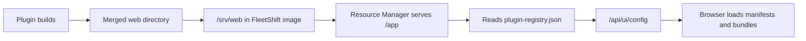
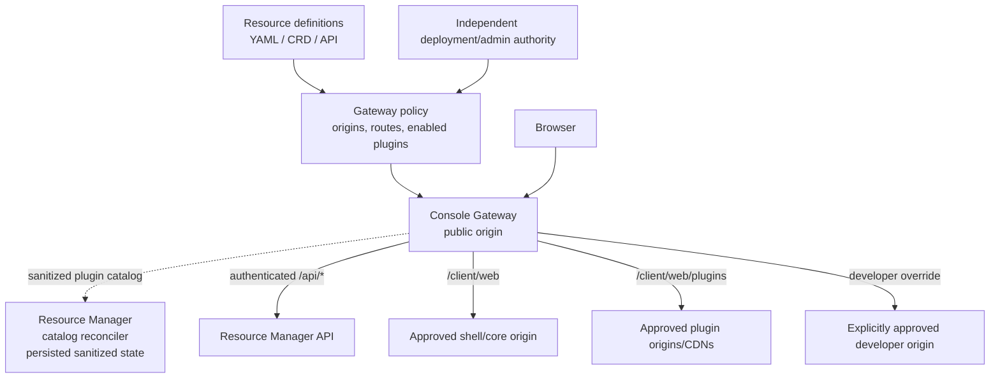
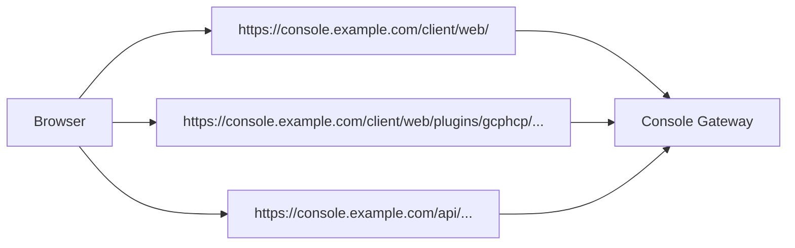
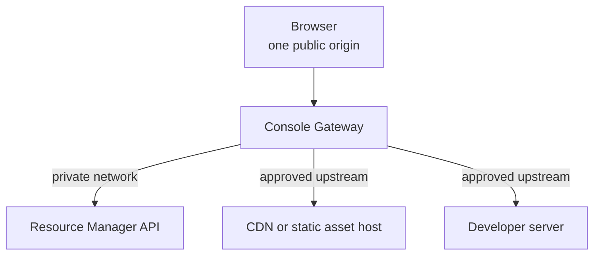
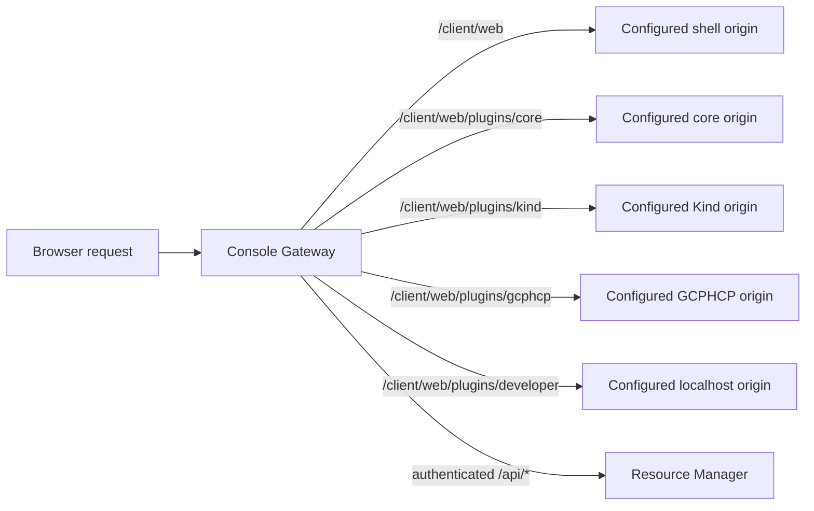
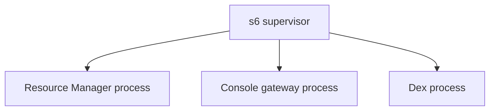
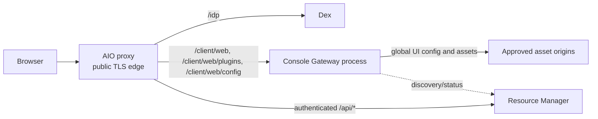
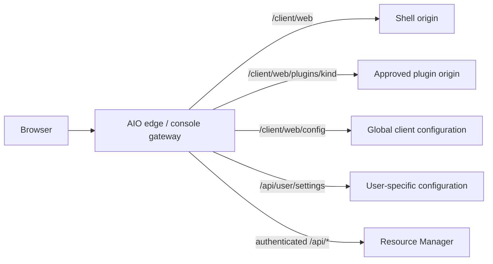
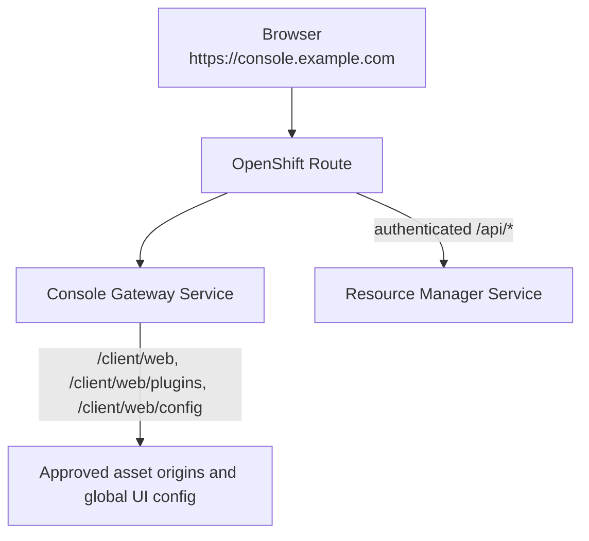
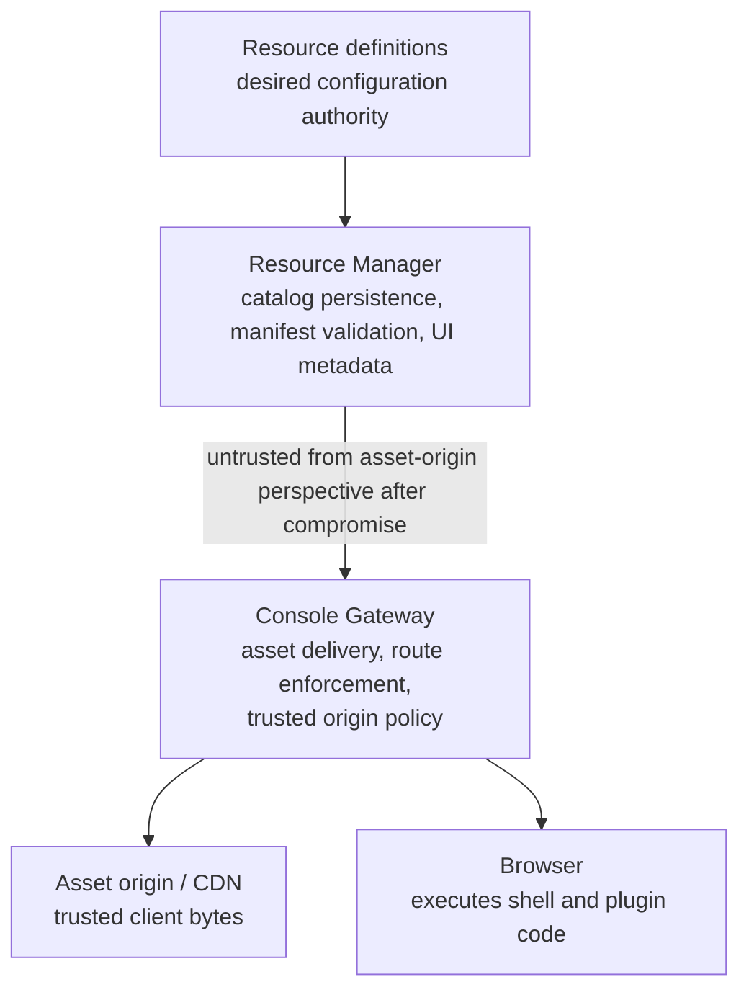

# Client Asset Separation

**Status:** Draft

**Related issue:** [OME-313](https://redhat.atlassian.net/browse/OME-313)

## Summary

Resource Manager currently serves the web shell, plugin manifests, and plugin JavaScript from one merged local asset directory. This makes Resource Manager an authority over client code. A compromised Resource Manager could return modified client code and undermine the client trust model.

This design separates browser asset delivery from Resource Manager while preserving one public browser origin. An independently trusted console gateway serves the shell and routes plugin asset requests to approved origins. Resource Manager stores and reconciles plugin metadata, but does not serve JavaScript bundles or control the gateway's trusted route policy. See [Discussion Note: Asset Ownership](#discussion-note-asset-ownership) for the ownership decision still under discussion.

This distinction is essential. If Resource Manager can freely change gateway routes, it can point the browser at a malicious origin after compromise. In that design, the gateway is only an asset proxy, not an independent trust boundary. OME-313 requires the gateway's trusted asset policy to be controlled outside Resource Manager and to reject unauthorized route changes.

The same model applies to core, community, and third-party plugins. The difference between them is deployment and ownership, not loading protocol.

An explored alternative is documented in [Explored Alternative: Asset Distribution Addon](#explored-alternative-asset-distribution-addon).

## Goals

- Keep browser asset delivery outside Resource Manager.
- Preserve one public origin for browser requests.
- Support CDN, internal HTTP origin, air-gapped static host, and local development origins.
- Avoid losing working plugin configuration when an origin is temporarily unavailable.
- Discover plugin metadata at runtime rather than compiling a fixed registry into Resource Manager.
- Support sandbox and cluster deployment with the same logical configuration.
- Allow plugin development without rebuilding the complete shell and plugin set.
- Define trust boundaries, caching, upgrades, and failure behavior.

## Non-goals

- Defining a complete addon marketplace or installation workflow.
- Implementing native CLI plugin distribution.
- Defining a storage-provider-specific implementation for S3 or OCI.
- Changing the existing Scalprum plugin model or plugin contracts.

## Current State

The current proof of concept follows this flow:



Current constraints:

- `plugin-registry.json` is generated during the build.
- Resource Manager reads the registry from `WebDir` on request.
- Resource Manager serves both API traffic and static assets.
- Asset origins are effectively hard-coded to `/app`.
- AIO has a separate reverse proxy process, but it currently routes Dex and Resource Manager only.
- The existing addon UI design already describes external manifest and asset URLs, but this is not yet the runtime deployment path.

## Target Architecture



The browser uses one public origin. It does not contact third-party CDNs or plugin origins directly. Console Gateway owns plugin resource definitions, manifest discovery, trusted origin selection, route policy, and global plugin availability. Resource Manager does not load or own those definitions. It receives a sanitized plugin catalog from Console Gateway, persists that catalog for resilience, and uses it for RBAC and user-specific settings. Resource Manager cannot modify gateway policy.

The gateway performs plugin discovery itself. It fetches manifests only from origins already approved by gateway policy, validates them, and exposes a read-only internal discovery endpoint to Resource Manager. That endpoint returns logical and non-sensitive metadata, such as plugin key, name, version, capabilities, dependencies, and availability. It does not grant Resource Manager authority over origins, credentials, mutable route policy, or gateway configuration.

### Browser origin versus upstream origins

“Separate deployment” describes workload and trust separation, not browser URL separation. The browser should normally call one public origin:



The gateway then forwards requests over private or controlled upstream connections:



The browser does not need to know whether Resource Manager, the CDN, or the console gateway runs in the same pod, a separate process, or a separate cluster Deployment. Keeping one browser origin also avoids exposing third-party CDN origins to browser policy, network restrictions, and plugin code.

Direct browser access to an asset CDN is possible only as an explicit weaker deployment mode. It is not the recommended default because it bypasses the gateway's origin policy and audit point.

The same rule applies to UI bootstrap configuration. Resource Manager may provide plugin metadata, but it cannot introduce arbitrary origins through the target `/client/web/config` endpoint. The console gateway validates every plugin origin and path against its independent policy. An unknown origin, unapproved path prefix, or plugin-to-origin mismatch is rejected. The gateway may also rewrite valid plugin metadata to same-origin `/client/web/plugins/...` URLs before returning the configuration to the browser. The browser must never receive an unvalidated direct origin from Resource Manager. The ownership alternative is described in [Discussion Note: Asset Ownership](#discussion-note-asset-ownership).

The console gateway does not need to proxy every Resource Manager API request to enforce this rule. The gateway is the trust boundary for browser assets and global UI bootstrap, not the business authorization boundary for platform APIs. AIO or OpenShift ingress may route authenticated `/api/...` requests directly to Resource Manager while routing `/client/web/`, `/client/web/plugins/...`, and global `/client/web/config` to the console gateway.

The console gateway can own global `/client/web/config` and use deployment-approved policy plus Resource Manager discovery/status. User-specific configuration, such as navigation visibility, plugin visibility, navigation order, or workspace-dependent plugin access, remains behind an authenticated Resource Manager endpoint. Persisted user preferences belong under the API/domain namespace, such as `/api/user/preferences` or `/api/user/settings`. The browser-facing effective projection can be exposed separately as read-only `/api/user/settings`. This projection should contain logical plugin IDs and user layout data, not arbitrary asset origins or gateway routes. Resource Manager continues to enforce authorization on every API and data request regardless of which plugins are visible.

Plugin discovery is global and public. The gateway publishes the complete approved plugin catalog through `/client/web/config`; knowing that a plugin could exist does not grant access to its data or operations. Resource Manager uses authenticated `/api/user/settings` only for user preferences, such as enabled or disabled plugins, navigation layout, and navigation order. The browser intersects those preferences with the global catalog when deciding what to render. The gateway does not need a per-user route table or a per-user asset configuration push. Plugin APIs still enforce authorization independently; hiding a plugin through user preferences is a UX choice, not the security boundary.

### Client configuration namespace

The target design should reserve `/client/*` for client-facing configuration and discovery rather than placing global bootstrap configuration under `/api`. `/api` remains the namespace for Resource Manager platform APIs and user settings. Web and CLI are both user interfaces, but they are different clients with different runtimes and configuration needs. The client type is represented below `/client/`, for example:

```text
/client/web/config
/client/cli/config
```

`/client/web/config` contains global browser bootstrap and plugin configuration. `/api/user/settings` contains the authenticated, read-only effective web UI configuration generated by Resource Manager. Persisted user preferences and settings use API/domain endpoints such as `/api/user/preferences`; those endpoints own updates and storage. `/client/cli/config` is reserved for future CLI discovery and configuration; it does not imply that the CLI consumes browser manifests or JavaScript assets. Future client types can use additional `/client/<type>/...` paths without changing the `/api` namespace.

The current `/api/ui/...` endpoints are the proof-of-concept shape. Migration to `/client/...` is a namespace cleanup and does not change the Scalprum plugin model.

The console gateway owns browser asset traffic, trusted origin selection, plugin policy, manifest discovery, and final global web configuration publication. Resource Manager owns a persisted last-known-good sanitized catalog received from the gateway and uses it for RBAC and user-specific settings. Resource Manager cannot introduce or change an origin. See [Discussion Note: Asset Ownership](#discussion-note-asset-ownership) for the unresolved ownership boundary.

### Authentication bootstrap and public assets

The browser cannot authenticate before it can load the code that performs authentication. The following web resources must therefore be available without a user session:

- Shell HTML and JavaScript under `/client/web/`.
- Approved plugin manifests and JavaScript/CSS under `/client/web/plugins/...`.
- Global `/client/web/config`.
- The identity-provider configuration required to start login, including issuer or authority, authorization endpoint, client ID, and scope.

Global `/client/web/config` must not require a bearer token. It needs to provide enough OIDC configuration for the browser to redirect the user to the identity provider and obtain a token. The console gateway can serve this configuration directly or proxy a public bootstrap response, but it must still enforce trusted plugin policy before returning plugin data.

The public boundary is intentional: `/client/web/`, `/client/web/plugins/...`, and `/client/web/config` are available without a user session. Every `/api/...` endpoint requires authentication and authorization. Infrastructure health and readiness probes, if needed, must use separately named operational endpoints rather than unauthenticated API routes. After login, the browser sends the access token to `/api/user/settings` and other Resource Manager APIs. User-specific plugin visibility, navigation settings, and data access are evaluated only through the authenticated API surface.

The internal gateway discovery endpoint is different from public browser configuration. It must not be exposed anonymously; it requires service-to-service authentication and authorization between the console gateway and Resource Manager. Public assets being unauthenticated does not make plugin data unauthenticated. Plugin APIs must continue enforcing user, tenant, workspace, and role authorization independently.

## Client Plugin Policy Resource

The deployment should define one policy resource for every plugin identity, with one or more client-specific artifacts. Each artifact declares its client type, because web and CLI plugins may be built and published separately with different manifests, entrypoints, and distribution mechanisms. The web artifact is loaded by Console Gateway, not Resource Manager. CLI and future client artifacts are consumed by their corresponding client catalog or distribution service.

The policy can be represented as YAML in sandbox mode and as a CRD, ConfigMap, Secret, or equivalent deployment-owned configuration in cluster mode. It contains authoritative distribution metadata for each client type, while keeping the plugin identity shared across clients.

Conceptual shape:

```yaml
apiVersion: ui.fleetshift.io/v1alpha1
kind: PluginClientPolicy
metadata:
  name: gcphcp
spec:
  plugin:
    name: gcphcp-plugin
    key: gcphcp
    version: 1.2.0
  clients:
    web:
      origin: https://assets.example.com/gcphcp/1.2.0/web
      manifestPath: plugin-manifest.json
      routePrefix: /client/web/plugins/gcphcp
      enabled: true
    cli:
      artifact: oci://registry.example.com/gcphcp-cli:1.2.0
      manifestPath: cli-manifest.json
      enabled: true
  required: false
```

The final API shape remains open. At minimum, the resource must identify:

- Stable plugin key and name.
- Plugin version.
- One or more client types, such as `web` or `cli`.
- Client-specific manifest or artifact location.
- Web asset origin and public route prefix, when `clientType` is `web`.
- Required versus optional behavior.
- Optional dependencies and compatibility constraints.
- Optional signature or provenance information.

Console Gateway validates web origins, manifest paths, asset paths, and public routes before publishing web plugins. Client-specific consumers validate their own artifact and manifest rules. Resource Manager receives only the resulting sanitized logical catalog and must not be the authority that adds or changes a web origin in the trusted set.

## Catalog Persistence

Resource Manager persists a runtime catalog received from Console Gateway. It does not persist or become authoritative for gateway policy definitions.

The gateway policy is authoritative for whether a plugin is available globally. The Resource Manager catalog is a last-known-good sanitized cache that allows RBAC and user-specific configuration to continue operating when the gateway or an asset origin is temporarily unavailable.

Conceptual catalog fields:

- Plugin identity and version.
- Available client types and per-client availability.
- Per-client policy key or opaque artifact reference.
- Validated manifest contents.
- Last successful validation time.
- Last attempted validation time.
- Current availability state.
- Last failure reason.
- Signature or provenance result, when used.

JavaScript and CSS bundles are not stored in Resource Manager. The gateway may cache them according to its deployment policy.

## Discovery and Reconciliation

Discovery is a reconciler, not a blocking one-shot startup operation.

### Startup

1. Console Gateway loads deployment-owned `PluginClientPolicy` resources.
2. Console Gateway loads its last-known-good manifest and route state.
3. Console Gateway fetches and validates manifests from approved origins.
4. Console Gateway publishes global `/client/web/config` from validated state.
5. Resource Manager loads its persisted sanitized catalog.
6. Resource Manager consumes the gateway's sanitized discovery catalog.
7. Resource Manager generates authenticated `/api/user/settings` from that catalog and its authorization data.
8. Both components retry their own failed refreshes asynchronously.

Resource Manager should not lose its sanitized plugin information because one origin is down or one manifest is malformed. Console Gateway should not lose its last-known-good global configuration for the same reason.

### Per-resource reconciliation

| Condition | Result |
| --- | --- |
| Gateway policy unchanged and cached state valid | Continue using cached state |
| Gateway policy changed and manifest validates | Atomically replace gateway state and sanitized catalog |
| Origin temporarily fails | Keep prior state active and record internal stale status |
| No cached state and fetch fails | Mark unavailable; continue startup |
| Manifest is permanently invalid | Keep prior state if present; report error |
| Plugin is absent from gateway policy | Remove from global catalog and active routes |
| Plugin is disabled in gateway policy | Remove from global catalog and active routes |

An entry absent from gateway policy must not remain globally active merely because cached metadata exists. Cache is fallback for failure, not an independent authorization source. A temporary fetch or reconciliation failure must not make an otherwise working plugin disappear. Active last-known-good state remains visible until the plugin is explicitly disabled or removed from gateway policy.

### Retry behavior

Retries should use bounded exponential backoff with jitter. The reconciler should expose status for:

- Last successful refresh.
- Last failed attempt.
- Next retry time.
- Number of consecutive failures.
- Whether active data is stale and still serving last-known-good state.

Stale means that active plugin metadata could not be refreshed from its configured origin or gateway policy source. It does not mean that the plugin is removed or unavailable to users. Users should continue seeing and using a working last-known-good plugin. Administrators should see freshness, retry, and validation failure status so they can diagnose the condition. A plugin should disappear only when it is explicitly removed or disabled from gateway policy, or when it has never had a valid configuration.

The initial design assumes startup load plus background reconciliation. A full dynamic watch mechanism can be added later without changing the resource or catalog model.

## Runtime UI Configuration Generation

The build-time `plugin-registry.json` is not the target runtime source of truth. The gateway's reconciled policy and manifest catalog become the input to global runtime UI configuration generation. Resource Manager receives a sanitized copy for authorization and user-specific settings.

After each catalog or trusted-policy change, the runtime configuration builder should:

1. Read active, validated, and policy-approved plugin entries.
2. Build global Scalprum configuration from those entries.
3. Generate plugin pages, module entries, labels, and other global plugin metadata.
4. Resolve each logical plugin identity and policy key to the gateway-approved manifest and asset routes.
5. Atomically publish a new immutable-in-memory configuration snapshot.

The console gateway serves the current snapshot through `/client/web/config`. The preferred implementation is for the gateway to perform the final merge of logical activation state and trusted route policy. Resource Manager may produce a candidate logical metadata snapshot, but the gateway must validate or rewrite all resolved asset references before serving it. The response should be no-cache or explicitly versioned because it changes when plugin resources reconcile. A failed reconciliation must leave the previous valid snapshot active; a single unavailable optional plugin must not make global UI configuration unavailable.

This global snapshot is separate from authenticated `/api/user/settings`. Resource Manager reads persisted preferences from API/domain storage, evaluates authorization, and generates user-specific plugin visibility, navigation layout, navigation order, and workspace-specific settings on request. Those settings contain logical plugin identifiers and presentation data, not asset origins or gateway routes. No per-user route configuration needs to be pushed into the console gateway.

The browser combines the two views by logical plugin identity. The gateway supplies the globally approved and available plugin set through `/client/web/config`; Resource Manager supplies the authorized user-specific set through `/api/user/settings`. A plugin is rendered only when it appears in both sets. This prevents Resource Manager from making an unapproved origin loadable and prevents a globally approved plugin from appearing for a user who is not authorized to use it.

The current `/api/ui/config` handler reads the build-time registry directly. Migration work must replace that read path with the runtime catalog and snapshot builder rather than simply moving `plugin-registry.json` to a new URL.

### Gateway discovery endpoint

The internal discovery endpoint should be private to the deployment and authenticated between Console Gateway and Resource Manager. It is a read-only data path from gateway to Resource Manager. It should return only the metadata Resource Manager needs for catalog reconciliation and RBAC evaluation:

- Stable plugin key and name.
- Version and availability state.
- Available client types, such as `web` and `cli`.
- Declared capabilities and dependencies.
- Validated manifest extension types and logical module identifiers.
- Policy key or opaque gateway-owned reference.

It should not return:

- An authority to register or replace origins.
- Gateway credentials or storage credentials.
- Mutable route policy.
- Browser-facing URLs that bypass gateway validation.

Resource Manager can use this catalog to calculate `/api/user/settings`. The gateway remains responsible for fetching manifests, resolving origins, generating or finalizing `/client/web/config`, and serving browser assets.

Client configuration generation is type-specific. The web catalog and Scalprum configuration are generated from `web` artifacts only. A future CLI catalog can consume `cli` artifacts and publish `/client/cli/config` without sending CLI manifests or artifacts through the Console Gateway's web asset routes.

## Gateway Manifest Validation

Console Gateway validates manifests before publishing a plugin to its global catalog or sanitized catalog endpoint. Validation should include:

- Manifest is valid JSON and matches expected schema.
- Manifest plugin name matches the gateway policy resource.
- Version matches the gateway policy resource or accepted version policy.
- Referenced scripts resolve below the configured asset origin.
- No credential-bearing URLs are accepted.
- No unexpected schemes are accepted.
- Route and origin do not overlap another plugin unexpectedly.
- Declared extension references satisfy platform rules.
- Signature or provenance validates when required by deployment policy.

Validation failure must not replace a previously validated active entry unless the gateway policy resource was removed or disabled.

## Console Gateway

The gateway is an independent browser-facing component. It may be implemented using an existing gateway/proxy technology or a small dedicated process for sandbox deployments. It must not require custom code for each plugin.

Example routing:



Core and community plugins use identical routing. Core plugins may be hosted on the same company CDN as community plugins.

The public path is intentionally independent from upstream layout. Console Gateway may rewrite `/client/web/` to a shell origin's `/app/` directory and `/client/web/plugins/gcphcp/...` to the approved GCPHCP origin's relative asset path. This allows the public client namespace to remain consistent without requiring every asset host or existing bundle to be rebuilt immediately.

The gateway is responsible for:

- Public TLS and same-origin browser access.
- Static asset serving where configured.
- Reverse proxying to HTTP(S) origins.
- Route isolation and path normalization.
- Upstream TLS verification.
- Origin and route allowlists.
- Timeouts, bounded retries, and failure responses.
- Cache headers and optional local caching.
- Access and routing audit logs.

Console Gateway publishes sanitized plugin discovery results and status to Resource Manager. Resource Manager must not be able to expand the gateway's trusted origin set by itself.

The sanitized catalog may contain logical metadata such as:

```json
{
  "plugin": "gcphcp",
  "version": "1.2.0",
  "enabled": true
}
```

This catalog is a read-only observation of gateway policy and discovery. It does not give Resource Manager authority to choose the asset origin. The distinction is:

```text
Trusted gateway policy:
  Is gcphcp approved?
  Which origin and path may serve it?

Resource Manager:
  Which authorized users may see gcphcp?
  Which version and capabilities are available to user configuration?
```

The gateway activates and publishes a plugin only when its own policy and manifest validation succeed. A compromised Resource Manager can alter its local sanitized catalog or user settings, but cannot introduce an unknown origin, replace a trusted origin, or change a route prefix in the gateway.

The gateway must obtain trusted route policy through an independent mechanism, such as:

- A deployment-owned mounted configuration or Secret.
- A configuration service controlled by the deployment administrator.
- A signed route policy whose signing key is unavailable to Resource Manager.
- A gateway-native control plane with independent authorization.

### Deployment-owned configuration

The gateway can receive its route policy from a file or Secret mounted only into the gateway process:

```yaml
routes:
  gcphcp:
    origin: https://cdn.example.com/gcphcp
    pathPrefix: /client/web/plugins/gcphcp
  core:
    origin: https://cdn.example.com/core
    pathPrefix: /client/web/plugins/core
```

Resource Manager cannot modify this policy when the deployment gives the gateway a separate service identity, mounts the file only into the gateway, and prevents Resource Manager from updating the Secret or configuration source.

This is the recommended first model for fixed deployment configuration: local policy YAML in sandbox and a gateway-only ConfigMap or Secret in cluster mode.

### Administrator-controlled configuration service

The gateway can read policy from a separate service controlled by the deployment administrator:

```text
Administrator or deployment controller
    -> route-policy service
    -> Console Gateway
```

Resource Manager reports that `gcphcp` version `1.2.0` is enabled. The gateway asks the route-policy service where that version may be served from. Resource Manager has no write access to the route-policy service.

This is useful when administrators need to update routes without editing mounted files.

### Signed route policy

An administrator or trusted deployment pipeline can create a signed policy:

```json
{
  "plugin": "gcphcp",
  "version": "1.2.0",
  "origin": "https://cdn.example.com/gcphcp/1.2.0",
  "pathPrefix": "/client/web/plugins/gcphcp"
}
```

The gateway trusts a verification key that Resource Manager cannot use for signing. It verifies the signature, plugin identity, version, origin, path binding, and optional expiration before accepting the policy.

This is useful when policy must be distributed across environments or when cryptographic provenance is required.

### Gateway-native control plane

When the selected gateway provides a dynamic configuration API, an administrator or deployment controller can configure routes directly:

```text
Administrator or deployment controller
    -> gateway control API
    -> Console Gateway route table
```

Resource Manager remains outside route authorization. It can expose plugin availability, but the gateway control plane decides whether a route exists.

This is useful when using Envoy, an ingress controller, or another gateway with established dynamic configuration and authorization.

The gateway must reject malformed, unsigned, unauthorized, or policy-violating route updates. A failed update must leave the previous known-good gateway policy active.

If Resource Manager is compromised, the expected outcomes are:

- Unknown plugin: rejected.
- Unknown origin: rejected.
- Wrong path on an approved origin: rejected.
- Changed version without approved policy: rejected or held at last-known-good version.
- Disabled plugin: remains inactive.

## Gateway Extensibility

The initial upstream contract should be HTTP(S). This covers CDNs, nginx, object-storage gateways, S3-compatible public endpoints, and local developer servers.

The gateway should not expose object-storage credentials to browsers. For S3, the preferred deployment is a CDN or HTTPS static gateway in front of the bucket.

If a deployment requires private or encrypted object storage, use a separate gateway-side fetcher or storage adapter. Do not add arbitrary executable proxy plugins to Resource Manager. Arbitrary proxy extensions would expand the trusted computing base and weaken the separation this design is intended to provide.

Possible future extension points:

- Declarative HTTP(S) upstreams.
- Gateway-side object-storage fetcher.
- Signed dynamic route configuration.
- Deployment-specific cache or content verification adapter.

## Deployment Models

### Sandbox AIO



Sandbox has no OpenShift Route or Service. The existing AIO proxy remains the public TLS edge and routes only the browser paths that require console-gateway handling to a separate local console-gateway process:



The AIO proxy currently routes Dex and Resource Manager directly. In the target sandbox topology, it continues to route authenticated `/api/*` requests to Resource Manager, routes `/idp` to Dex, and routes `/client/web/`, `/client/web/plugins/...`, and global `/client/web/config` to the console gateway. The console gateway owns global UI bootstrap and asset routing. It may obtain plugin discovery and status from Resource Manager, but Resource Manager does not select trusted origins.

This keeps public TLS, Host validation, WebSocket handling, and s6 supervision in the existing AIO proxy while preserving an independent console-gateway process and configuration boundary. It also avoids placing the console gateway in front of unrelated Resource Manager APIs. Extending the AIO proxy to perform asset routing directly remains possible, but would combine public edge and asset-origin policy into one process.

Browser traffic remains on the same public AIO origin:



Resource definitions come from a local YAML file, environment variable, or CLI argument. The same route policy rules apply as in cluster mode; only the configuration loading and ingress mechanism differ.

### Cluster deployment

The console gateway runs as a separate Deployment and Service. Resource Manager and the gateway communicate over an internal authenticated channel or through the cluster API/configuration mechanism.

The OpenShift Route terminates or forwards the public console hostname to the console gateway Service:



The OpenShift Route is the first network ingress hop. It provides public TLS, host/path matching, and routing to in-cluster Services. The console gateway is the first application routing hop for browser assets and global UI bootstrap, while Resource Manager remains a direct upstream for `/api`. Dynamic plugin routes and origin policy remain outside static OpenShift Route configuration. OpenShift Route should not be treated as the component that validates plugin origins or proxies directly to arbitrary CDN hosts.

Plugin asset resources are loaded from the deployment namespace. A CRD is the preferred long-term representation if the cluster deployment owns the configuration lifecycle.

### Connected deployment

Plugin assets may be hosted on a company CDN or approved external CDN. The browser still uses the public gateway origin; the gateway fetches from the CDN.

### Air-gapped or restricted-network deployment

Assets are mirrored to an internal static host or gateway-accessible cache. The same plugin resource points to the internal origin. No browser connection to an external CDN is required.

### Developer override

A plugin resource may point one plugin to a local development server:

```yaml
name: gcphcp
origin: http://host.docker.internal:3001
routePrefix: /client/web/plugins/gcphcp
```

All other plugins continue using normal origins. This avoids rebuilding and redeploying the complete shell for every plugin change.

## Configuration Loading

The resource model should be shared across deployment modes.

| Mode    | Resource input                                   |
| ------- | ------------------------------------------------ |
| Sandbox | YAML file, environment variable, or CLI argument |
| Cluster | Namespace-scoped CRD or equivalent API resource  |
| Tests   | In-memory resource list or fixture YAML          |

Loading mechanism differs by environment; normalization and reconciliation do not. This avoids maintaining separate sandbox and cluster configuration models.

## Trust Boundaries

Target boundaries:



Separation fails if Resource Manager can freely redirect the browser to an untrusted origin. The design therefore requires:

- Origin allowlists owned outside Resource Manager.
- Route-prefix policy owned outside Resource Manager.
- No credentials in URLs.
- Gateway-side validation of every route update.
- Independent gateway deployment identity and authorization.
- Independent approval or signature for new origins.
- Audit logs for route-policy changes.
- Fail-closed behavior when trusted policy cannot be loaded.

Signed route metadata is the preferred mechanism when Resource Manager is in the threat model. A deployment-owned allowlist can be sufficient only when plugin origins are fixed by deployment configuration and Resource Manager can change activation state but not origin mapping. Plain unsigned route settings written by Resource Manager are not sufficient.

## Caching and Upgrades

Manifests and runtime configuration are mutable metadata and should use revalidation or no-cache behavior. JavaScript and CSS bundles must use content-hashed filenames before they receive immutable cache headers. This requirement applies to the shell as well as every plugin; version directories alone are not sufficient if a file can be replaced at the same URL.

Recommended cache behavior:

- `plugin-manifest.json`: revalidate or short-lived cache.
- Runtime UI configuration: no-cache or explicit versioned response.
- Content-hashed shell and plugin JavaScript/CSS: long-lived immutable cache.
- Gateway last-known-good route state: persistent and recoverable.

The build pipeline must verify that emitted shell and plugin JavaScript/CSS filenames contain content hashes and that referenced files use those hashed names. The deployment must not apply immutable caching to an un-hashed bundle. Existing shell output should be checked explicitly; plugin hashing must not be assumed to imply shell hashing.

Plugin upgrade sequence:

1. Publish new version to asset origin.
2. Validate new manifest through the reconciler.
3. Persist validated metadata.
4. Publish new route/catalog state to gateway.
5. Retain old asset version for rollback and cache safety.

Rollback changes the gateway policy resource to a previously validated version. It does not require rebuilding Resource Manager.

## CLI and Native Clients

The plugin resource should keep identity, version, dependency, and provenance fields usable by future CLI or native clients. This document does not define their binary distribution mechanism.

Web-specific fields such as manifest URL, asset origin, and route prefix belong to a UI capability within the broader resource model. Future native clients may use the same plugin identity and catalog while selecting different artifacts.

## Alternatives Considered

### Resource Manager serves all assets

Rejected for target architecture. It preserves the current implementation but does not separate client-code trust from Resource Manager.

### Browser loads third-party CDN URLs directly

Rejected as default. It creates origin, CSP, network-policy, and auditing problems. It can remain an explicitly controlled deployment option only if security policy permits it.

### Gateway with arbitrary Resource Manager proxy plugins

Rejected. It makes Resource Manager part of the gateway's trusted code and creates uncontrolled extension risk.

### Push bundles into Resource Manager

Rejected. Resource Manager should store metadata and validated manifests, not client bundle bytes. Asset publication and rollback belong to the asset host.

## Open Questions

1. Must route/catalog updates be cryptographically signed for the OME-313 threat model, or are deployment allowlists sufficient?
2. Should Console Gateway serve global `/client/web/config` while Resource Manager serves authenticated `/api/user/settings`, or should one component own both responses? See [Discussion Note: Asset Ownership](#discussion-note-asset-ownership) and [Discussion Note: Per-user Configuration and RBAC](#discussion-note-per-user-configuration-and-rbac).
3. Is a generic `PluginClientPolicy` resource the correct name and scope for gateway-owned plugin definitions?
4. Should route updates use an authenticated API, a mounted file, or a gateway-native dynamic configuration protocol?
5. Should OpenShift Route provide only public ingress and Service routing, with Console Gateway or an asset distribution addon handling dynamic asset-origin routing and policy?
6. Should stale plugin status be exposed to administrators through the management UI and API, and which operational metrics or alerts are required? Active stale plugins remain visible to users.
7. What availability policy applies to `required: true` plugins?
8. Is direct CDN access ever allowed, or must all browser traffic always pass through the gateway?
9. What manifest signature and artifact provenance format should be adopted?
10. Should asset distribution be implemented by the Console Gateway, an independently deployed asset distribution addon, or a shared interface supporting both?
11. Which implementation Jira issues should be created after design review?
12. What internal authentication and protocol should protect the gateway-owned plugin discovery endpoint?
13. Which component owns unauthenticated identity-provider bootstrap configuration in `/client/web/config`?

## Expected Implementation Outcomes

Once this design is approved, implementation work is expected to split into independent outcomes:

- Runtime plugin asset resource and configuration loading.
- Persisted last-known-good plugin catalog.
- Manifest fetch, validation, reconciliation, and retry.
- Asset gateway routing and configuration publication.
- Sandbox AIO gateway process integration.
- Cluster gateway Deployment and Service.
- Developer localhost asset override.
- Security policy, origin allowlists, and optional signatures.
- Content-hashed shell and plugin bundles, including build-time validation and cache-header enforcement.
- UI configuration migration from build-time registry to runtime catalog.
- Runtime global UI configuration snapshot generation and atomic publication.
- Gateway-owned manifest discovery and sanitized internal plugin catalog.
- Client-type-aware plugin policy and separate web/CLI artifact catalogs.
- Separation of global `/client/web/config` from authenticated `/api/user/settings`.
- Unauthenticated web bootstrap and identity-provider configuration, with authenticated user settings and API access.
- Observability and administrative status for stale, retrying, and never-valid plugins; active last-known-good plugins remain visible to users.

## Discussion Note: Asset Ownership

Open design question: should the Console Gateway own browser assets and global UI bootstrap, while Resource Manager remains responsible for user-specific UI configuration and authorization?

The strongest practical separation is for the Console Gateway to own the global browser asset surface and `/client/web/config`. Resource Manager would expose platform APIs, plugin discovery/status, and authenticated user-specific configuration; it would not serve assets, select arbitrary asset origins, or be required to understand frontend bundle layout. The gateway would obtain approved global plugin state, enforce origin policy, serve or proxy assets, and produce global browser bootstrap configuration.

An alternative keeps global UI metadata generation in Resource Manager while the Console Gateway validates and rewrites the result. This preserves more of the current implementation but leaves Resource Manager coupled to frontend configuration and increases the amount of gateway filtering required after a compromise. It does not remove the need for Resource Manager to provide user-specific configuration when RBAC or multitenancy changes what a user can see.

Decision needed: do we want Resource Manager to be completely abstracted from frontend asset delivery while retaining ownership of user-specific authorization data, or do we intentionally retain Resource Manager as the global plugin metadata service behind the gateway?

## Discussion Note: Per-user Configuration and RBAC

Global plugin availability and user-specific plugin visibility are different concerns. The Console Gateway can serve the same global `/client/web/config` to every user because it contains only approved origins, manifests, and globally enabled plugin metadata. Resource Manager should serve `/api/user/settings` after authenticating the user and evaluating workspace, tenant, and role permissions.

User-specific configuration should contain logical plugin identifiers, navigation layout, navigation order, and other presentation choices. It should not contain arbitrary asset origins or gateway route definitions. The browser uses the logical identifiers to select from globally approved plugin configuration.

This avoids pushing a per-user route table from Resource Manager into the Console Gateway. It also preserves the correct security boundary: Resource Manager decides whether a user may access data and operations, while the Console Gateway decides whether an asset origin is trusted. Hiding an unauthorized navigation entry improves the user experience, but every Resource Manager API must independently enforce authorization. A user who can load a plugin bundle but lacks permission for its data must receive an authorization error from the API, not protected data.

If a future requirement makes asset origins themselves tenant-specific, the gateway must receive logical tenant-scoped route selection rather than arbitrary URLs. It must resolve that selection against independently trusted policy before serving assets.

## Explored Alternative: Asset Distribution Addon

Another option considered was an independently deployed asset distribution addon. The addon would own plugin manifests, asset retrieval, caching, origin policy, and browser UI bootstrap. It could serve the shell and plugin assets without making Resource Manager the asset server.

This could remove the need for a dedicated asset-routing implementation, but it does not automatically remove the need for an edge or ingress component. If the browser must continue using one public origin, OpenShift Route or the AIO proxy still needs to route public requests to the asset distribution addon and Resource Manager. In that model, the addon replaces the Console Gateway's asset-serving function, while the existing edge retains public routing.

The addon could also be exposed directly on a separate browser origin, but that introduces CORS, CSP, cookie, network-policy, and auditing concerns. It is not the preferred default.

This alternative is rejected for the current design. If Resource Manager can register, configure, replace, or activate the asset distribution addon, a compromised Resource Manager could make a fake addon appear trusted and use it to serve compromised assets. Preventing that would require another independently trusted addon lifecycle, deployment authority, and policy channel. That effectively creates a new privileged addon type and recreates the Console Gateway boundary with more moving parts, so treating asset distribution as an infrastructure gateway is simpler and clearer.

An asset distribution addon would only be viable if it were independently provisioned and trusted, and Resource Manager could not modify its code, origin policy, or activation authority. That is outside the scope of this design. The recommended model remains an independently deployed Console Gateway with deployment-owned or signed route policy.
